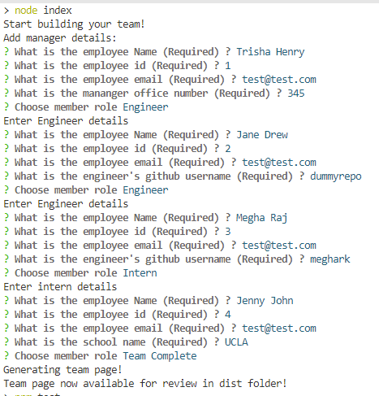
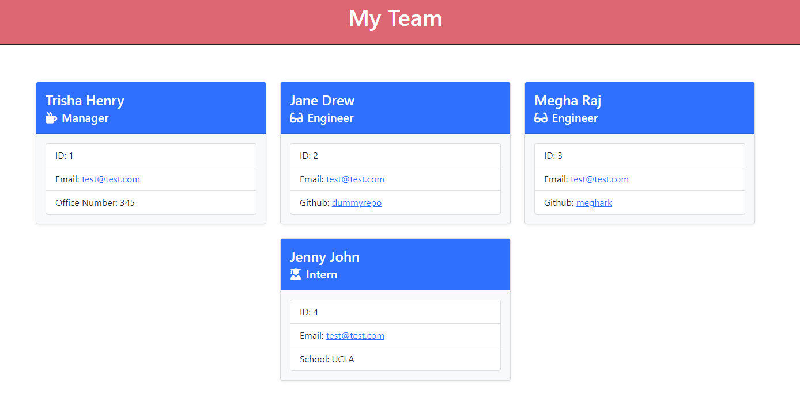

# Team Details Generator

## Description

This is a command line application that generates a formatted team roster page.
The application takes user input for employee details.
Users can add a manager, multiple employees and interns.
For all employee types user will have to provide a name, id and email.
For adding a manager a office number is required.
For adding an engineer a github link is required.
For adding an intern a school name is required.

The user inputs will have to pass the following validations:
1. All inputs are mandatory.
2. Id which stands for employee id will have to be whole number and cannot be reused.
3. Email should have a valid format.

On running the application user will be asked to provide the manager details.
Then on they will be give an option to choose an engineer, intern or complete the team entry.
Once the team creation is complete, index.html is available in dist folder.
Clicking on email will open up the default email program with the email address pre-populated.
When clicked on github username the github profile page is displayed.
   
    
## Table of Contents
    
- [Installation](#installation)
- [Usage](#usage)
- [Questions](#questions)
    
       
## Installation
    
To run the command line application.
- Clone the repository
- Run npm install

## Usage

Run node app.js from the project directory to run the application.
Provide user inputs for the questions.
Check console for any errors.
If the program runs without errors, the dist folder will have the index.html with team details.
Use as required.

## Command line app screenshot

## Link to demo video

Use the following video to access a short demo on the application.

# Questions

if you have any questions about the repository, open an issue/pr or contact me directly at megha.nambiar@gmail.com 
You can find more of my work at [Github](https://github.com/meghark).

    